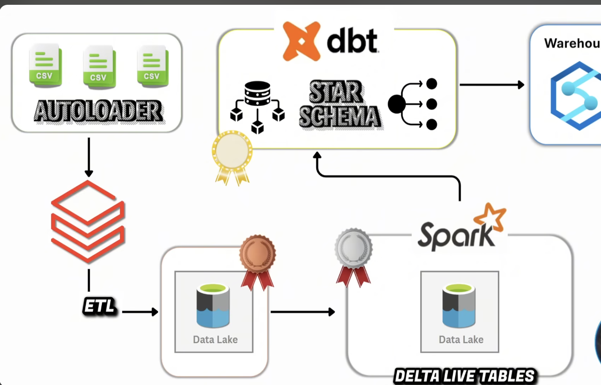

✈️ Databricks End-to-End Data Engineering Project – Flight Booking Analytics Platform

📌 Project Overview

This project demonstrates the implementation of a complete end-to-end Data Engineering solution on Databricks using the Medallion Architecture (Bronze, Silver, and Gold layers).

The solution ingests raw flight booking datasets incrementally using Databricks Auto Loader, processes and validates data using Lakeflow Declarative Pipelines (Delta Live Tables), and builds a dimensional data warehouse consisting of Fact and Dimension tables optimized for analytical reporting.

The project simulates a real-world airline booking platform and demonstrates:

* Incremental Data Ingestion
* Change Data Capture (CDC)
* Data Quality Validation
* Delta Lake MERGE Operations
* Surrogate Key Generation
* Star Schema Design
* Workflow Orchestration
* Metadata-Driven ETL Frameworks

 Project Highlights

* Built a metadata-driven ingestion framework using Databricks Workflows and For-Each loops.
* Implemented incremental ingestion using Auto Loader and Delta checkpoints.
* Developed CDC pipelines using Lakeflow Declarative Pipelines (DLT).
* Designed a dimensional warehouse using Fact and Dimension tables.
* Implemented surrogate key generation and Delta MERGE based UPSERTs.
* Integrated dbt Cloud to build business-ready analytical models.
* Created a complete Medallion Architecture (Bronze → Silver → Gold → Analytics).

⸻

🏗️ Architecture

The solution follows the Medallion Architecture pattern.

Raw CSV Files
      ↓
Auto Loader
      ↓
Bronze Layer
      ↓
Lakeflow Declarative Pipelines
      ↓
Silver Layer
      ↓
Dimension & Fact Modeling
      ↓
Gold Layer
      ↓
dbt Cloud
      ↓
Analytics Models
      ↓
Business Reporting



⸻

🛠️ Technologies Used

* Databricks
* Apache Spark
* PySpark
* Delta Lake
* Databricks Workflows
* Auto Loader
* Lakeflow Declarative Pipelines (DLT)
* Unity Catalog
* Delta MERGE
* Databricks Volumes
* dbt Cloud

⸻

📂 Data Sources

The project processes the following datasets:

Dataset	Type
Bookings	Fact
Flights	Dimension
Airports	Dimension
Customers / Passengers	Dimension

To simulate real-world ingestion scenarios, incremental datasets were also created and loaded after the initial ingestion.

⸻

🥉 Bronze Layer

Objective

Build a reusable ingestion framework capable of loading multiple datasets without duplicating notebook logic.

Features

* Databricks Auto Loader
* Incremental File Processing
* Checkpointing
* Schema Evolution
* Parameterized Notebook Design

Generic Ingestion Framework

A reusable notebook was built using Databricks Widgets.

Example:

src = "bookings"

The same notebook can ingest:

* bookings
* flights
* airports
* customers

without any code changes.

⸻

Bronze Notebook

Insert Bronze Auto Loader Notebook Screenshot Here

⸻

Bronze Data

Insert Bronze Tables Screenshot Here

⸻

🔄 Workflow Orchestration

Databricks Workflows were used to orchestrate the ingestion process.

Parameters Notebook

A metadata-driven parameter notebook generates:

[
  {"src":"bookings"},
  {"src":"flights"},
  {"src":"airports"},
  {"src":"customers"}
]

For-Each Processing

A Databricks For-Each task dynamically executes the Bronze ingestion notebook for each dataset.

Benefits

* Reduced code duplication
* Reusable framework
* Easy onboarding of new datasets

⸻

Workflow Screenshot

Insert Databricks Workflow Screenshot Here

⸻

🥈 Silver Layer

The Silver Layer was implemented using Lakeflow Declarative Pipelines (DLT).

Objectives

* Data Cleansing
* Data Standardization
* Data Validation
* CDC Processing

⸻

Bookings Pipeline

Transformations performed:

* Amount datatype conversion
* Booking date conversion
* Metadata enrichment
* Removal of rescued records

Data Quality Rules:

booking_id IS NOT NULL
passenger_id IS NOT NULL

Invalid records are automatically dropped.

⸻

Flights, Airports & Passengers

CDC pipelines were implemented using:

dlt.create_auto_cdc_flow()

Features:

* Incremental Processing
* SCD Type 1 Handling
* Latest Record Maintenance

⸻

DLT Pipeline Graph

Insert DLT Pipeline Screenshot Here

⸻

CDC Processing Screenshot

Insert CDC Pipeline Screenshot Here

⸻

🥇 Gold Layer

The Gold Layer implements a dimensional warehouse using Fact and Dimension tables.

⸻

📊 Dimension Tables

Dimensions Created:

* DimPassengers
* DimFlights
* DimAirports

Features

Incremental Loading

Only records modified after the previous load are processed.

Surrogate Key Generation

Example:

Business Key	Surrogate Key
passenger_id = P001	DimPassengersKey = 1

Delta MERGE

Delta Lake MERGE operations were used to perform UPSERT operations.

⸻

Gold Dimension Tables

Insert Gold Dimension Screenshot Here

⸻

📈 Fact Table

FactBookings was created using dimensional modeling principles.

Process

1. Read incremental records from Silver Bookings
2. Lookup surrogate keys from dimensions
3. Replace business keys with surrogate keys
4. Create analytical fact table

Example:

Before

passenger_id	flight_id	airport_id
P001	F001	A001

After

DimPassengersKey	DimFlightsKey	DimAirportsKey
1	10	100

⸻

Gold Fact Table

Insert Gold Fact Screenshot Here

⸻

⭐ Star Schema

The Gold layer follows a Star Schema design.

                 DimPassengers
                       |
                       |
                       |
DimFlights ---- FactBookings ---- DimAirports

⸻

Star Schema Diagram

Insert Star Schema Screenshot Here

⸻

🚀 Incremental Processing Strategy

Incremental processing was implemented across all layers.

Layer	Incremental Strategy
Bronze	Auto Loader Checkpoints
Silver	CDC Processing
Gold	Modified Date Based Incremental Loads

Benefits

* Faster Processing
* Reduced Cost
* Improved Scalability
* Production-Ready Architecture

⸻

✅ Data Quality Framework

The project includes data quality checks in the Silver Layer.

Examples:

* Null Validation
* Schema Enforcement
* Datatype Standardization

This ensures only clean and validated data reaches the Gold Layer.

⸻

📊 Analytics Layer with dbt Cloud

After building the Bronze, Silver, and Gold layers in Databricks, dbt Cloud was used to create an analytics layer on top of the curated warehouse tables.

Objective

Transform warehouse-ready datasets into business-friendly analytical models using dbt.

dbt Cloud Integration

A connection was established between dbt Cloud and Databricks.

The Gold layer tables were used as source datasets for dbt transformations.

The project demonstrates how Analytics Engineering can be layered on top of a modern Data Engineering platform.

⸻

dbt Model

A dbt model named: first_dbt_model was created and executed using dbt Cloud.

The model aggregates booking revenue by country and stores the output inside Databricks.

Output Location:
Catalog : workspace
Schema  : dbt_sdoss
Table   : first_dbt_model

⸻

Business Logic

The dbt model calculates:

Total Booking Revenue by Country

Example Output:

Country	Total_Amount
India	125000
USA	98000
UK	76000

This analytical model can be directly consumed by reporting tools and business users.

⸻

dbt Architecture

Gold Layer Tables
        ↓
    dbt Cloud
        ↓
Transformations
        ↓
Country-Level Revenue Model
        ↓
workspace.dbt_sdoss.first_dbt_model

⸻

dbt Cloud Screenshots

dbt Cloud Connection

Insert Screenshot

⸻

dbt Job Execution

Insert Screenshot

⸻

dbt Model Output

Insert Screenshot

⸻


:::
One more suggestion: rename the repository to something like:
```text
databricks-flight-booking-medallion-architecture

or

end-to-end-databricks-data-engineering-project

rather than a generic name. Recruiters often judge projects from the repository title before they even open the README.

📚 Key Learnings

Through this project I gained hands-on experience with:

📚 Key Learnings

Through this project I gained hands-on experience with:

* Medallion Architecture
* Databricks Auto Loader
* Databricks Workflows
* Lakeflow Declarative Pipelines (DLT)
* Delta Lake
* Delta MERGE Operations
* CDC Processing
* Incremental Data Loading
* Surrogate Key Generation
* Fact & Dimension Modeling
* Star Schema Design
* Metadata-Driven ETL Frameworks
* Unity Catalog
* dbt Cloud Integration
* Analytics Engineering Fundamentals
* Business Metric Aggregation
* End-to-End Data Platform Development

⸻

🔮 Future Enhancements

* SCD Type 2 Dimensions
* CI/CD Pipeline Integration
* Terraform Deployment
* Data Quality Dashboard
* Automated Data Lineage
* Data Governance using Unity Catalog

⸻

📸 End-to-End Execution Proof

Insert Final End-to-End Pipeline Screenshot Here

⸻

🎯 Conclusion

This project demonstrates the implementation of a modern Databricks-based Data Engineering platform capable of handling incremental ingestion, CDC processing, dimensional modeling, and analytical data warehousing using industry-standard engineering patterns and best practices.

The solution showcases how Auto Loader, Delta Lake, Lakeflow Declarative Pipelines, and Databricks Workflows can be combined to build scalable and maintainable data platforms.